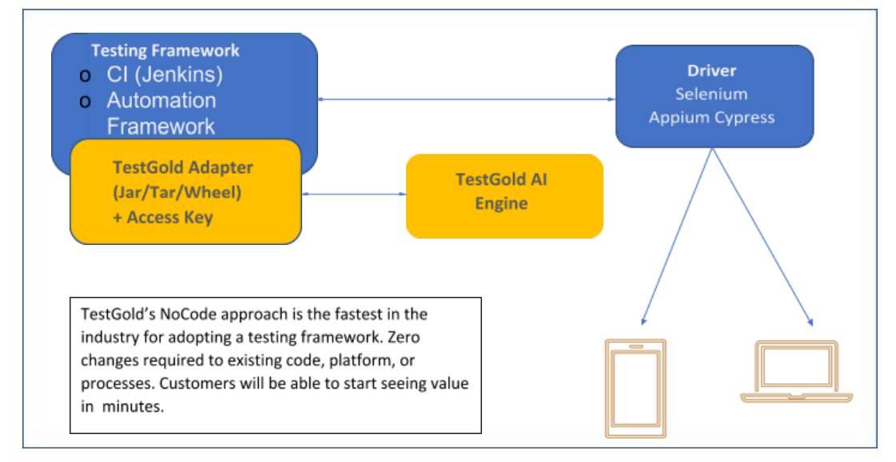
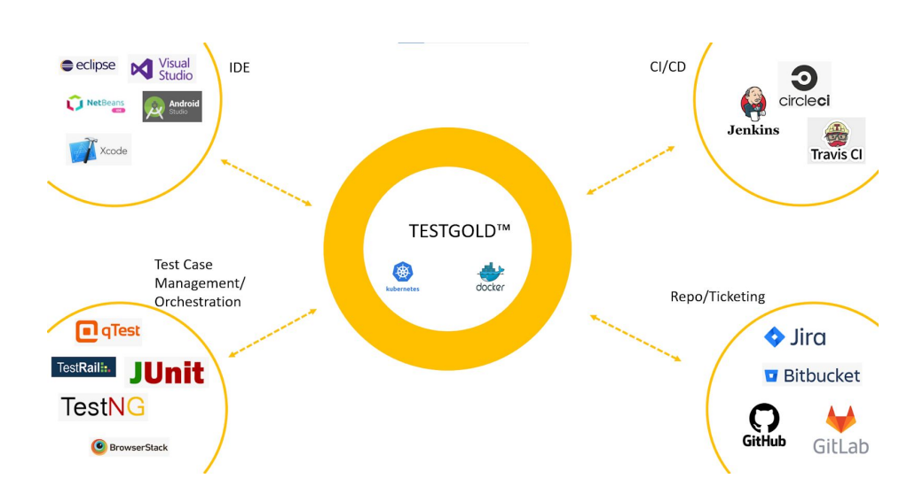

Architecture & Installation 
============================

Architecture
-------------

TESTGOLD™ Architecture
TESTGOLD™ built to scale in support of cloud platform computing. Built to be deployed on
Docker containers or Kubernetes clusters (as required to support scale and performance
requirements).
The architecture is distributed with the interface JAR/Tar sitting on the devops stack and the AI
engine deployed on a Cloud Cluster.

TESTGOLD™ Adapter
The TESTGOLD™ adapters support most languages when using Selenium/Appium/Cypress for
testing. TESTGOLD™ adapters are currently available for Java, Python, Node.js, Javascript and
Typescript. This is the communication layer to access the TESTGOLD™ AI Engine.

TESTGOLD™ Access Key
The Access Key, set as an environment variable, informs the TESTGOLD™ AI Engine that the
access is authorized. This extra layer of security protects the organization’s data and ensures
only permitted accesses take place. The access keys can be refreshed periodically to prevent
theft and misuse.

Installation
-------------

TESTGOLD™ Installation Options
The TESTGOLD™ Adapters and the Access Key connect to the TESTGOLD™ AI Engine.
As seen in the architecture diagram above, these can be installed on the CI platform such as
Jenkins, or a test Automation Framework such as SauceLabs or on even the IDE, providing
immense flexibility to access the TESTGOLD™ AI Engine.

The TESTGOLD™ AI Engine can be deployed in one of the following 3 ways:

1. TESTGOLD™ Cloud: The TESTGOLD™ Cloud is deployed on a massively scalable
Kubernetes cluster. Tests run locally on enterprise servers or on the enterprise cloud can
connect to the TESTGOLD™ Cloud and start healing the failing tests. This is the fastest
way to get started and requires no setup.

2. Private Cloud: This option will require a deployment of the TESTGOLD™ AI Engine on an
enterprise private cloud. Kubernetes is recommended for large scale use. A Docker
deployment readily supports smaller scale use cases.

3. On-Prem: This setup is akin to that of the Private Cloud, and the TESTGOLD™ AI Engine
will be deployed on the on-prem server. Accordingly,Kubernetes is typically used for
larger scale production; Docker deployment is sufficient for smaller scale environments.
Customers may find this to be the most complex option to set up. Deploying on-prem
servers does not scale as readily as Options 1 or 2..

SauceLabs / BrowserStack / SeleniumGrid InstallationTESTGOLD™ deployment on Testing platforms like SauceLabs, BrowserStack and SeleniumGrid
is akin to that shown in Figure 1 above. The driver shown in the figure will instead be a Remote
Driver, and the installation will be identical to the above.

CI/CD Integration
-------------------

   
   
Drop-In Activation in your existing CI/CD

TESTGOLD™ can be dropped into your CI/CD stack and activated within seconds to
deliver continuous quality.

TESTGOLD™ is codeless/plug-n-play; integrating out of the box with existing
infrastructure

TESTGOLD™ is built on massively scalable architecture, scaling to fit any enterprise.

TESTGOLD™ enables fast and accurate response to change making in truly agile in todays day and age.

