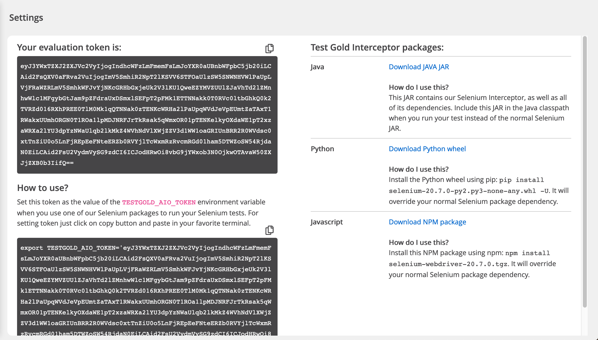
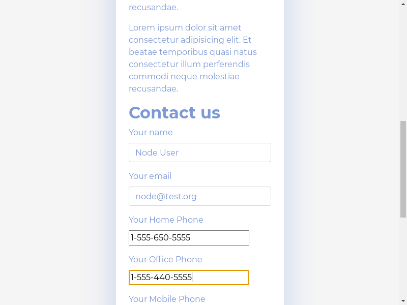
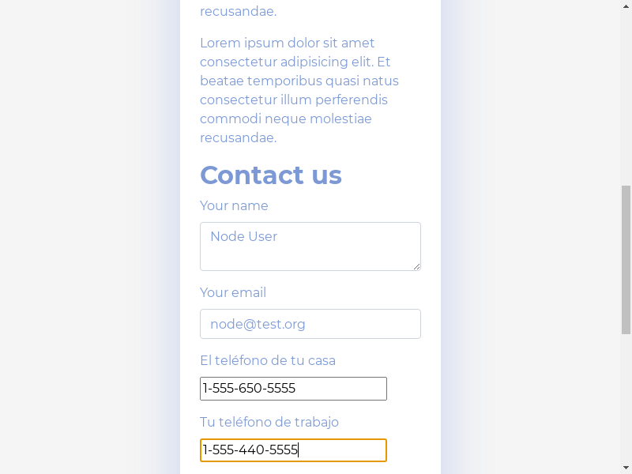
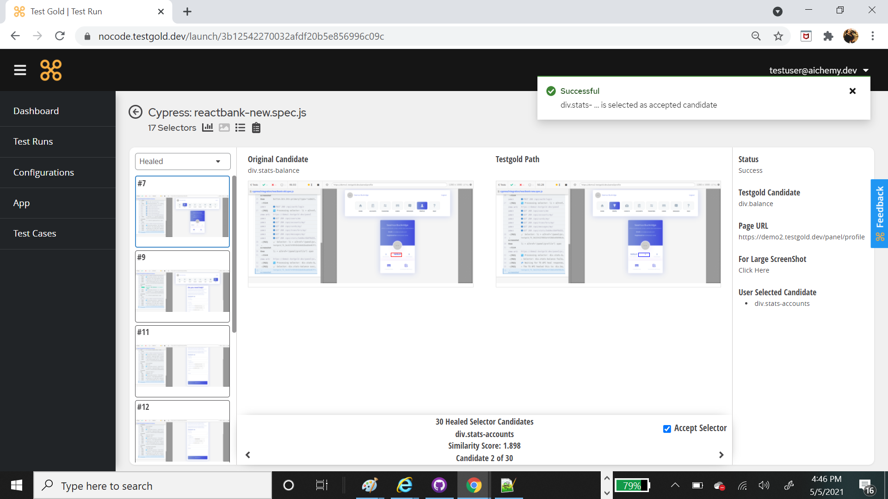

Using the TestGold Interceptor
==============================

We  support direct calls to our healing API from Selenium tests running
outside of our own service. For this purpose, we have released Selenium packages
for Java, Javascript, and Python that interface with our API and obtain healed
XPaths or CSS selectors for web automation tests that run in your own
environment. These *TestGold Interceptor* packages can be used in place of the
usual Selenium packages to take advantage of our API.

These packages are downloadable on the configurations page, after your account is activated. Contact `support@testgold.dev
<mailto:support@testgold.dev>`_ if you are not activated within 24 hours.

Using the Interceptor packages
------------------------------

A single environment variable is required for the Interceptor packages to
interface with our API. Set the **TG_TOKEN** as directed on the
download page, then install one of the Interceptor packages.

- **Java**: Download the Interceptor package JAR and replace any references to
  the usual Selenium JAR in your test classpaths with this JAR.

- **Javascipt**: Download the Interceptor package and install it using NPM:
  ``npm install <interceptor-package-name>.tgz``. This will override your usual
  Selenium NPM dependency automatically.

- **Python**: Download the Interceptor package and install it using pip:
  ``pip install <interceptor-package-name>.whl``. This will override your usual
  Selenium Python package dependency automatically. Make sure that your python and pip paths are properly configured. You can check those with ``which python`` and ``which pip`` in your terminal.

- **Cypress**: Download the Cypress Interceptor Package and install it using NPM.

Run your Selenium tests as normal, making sure the **TG_TOKEN**
environment variable is set. The Interceptor will log its actions and the
results of the XPath/CSS selector healing process to the terminal console. It
will also provide a **results URL** where you can browse the results of each
encounter and the outcomes of the healing process.

Customizing Interceptor execution
---------------------------------

You may set the following environment variables to customize how the Interceptor
package and our API heals your tests:

- **TG_ENABLED**: This is set to '1' by default. Set this to '0' to make
  the Interceptor package behave exactly like normal Selenium, with no calls to
  the TestGold API for healing broken XPaths or CSS selectors.

- **TG_SERVER_TIMEOUT**: Sets how long to wait for each broken XPath or CSS
  selector to be healed by the TestGold API. Most heals are complete within 30
  seconds for uncomplicated web pages, but highly complex web pages may take
  several minutes for the TestGold API to return a result for broken
  XPaths or CSS selectors. This is set to 10 minutes by default.

- **TG_FILTER_DISPLAYED**: This is set to '0' by default. If set to '1',
  only currently displayed elements will be used to generate a snapshot of the
  current state of a web page for the TestGold API instead of all elements. This
  can greatly speed up processing for a highly complex web page.

- **TG_FILTER_ENABLED**: This is set to '0' by default. If set to '1',
  only currently enabled elements will be used to generate a snapshot of the
  current state of a web page for the TestGold API instead of all elements. This
  can greatly speed up processing for a highly complex web page.

- **TG_NEIGHBOR_MAXDIST**: This sets the maximum radius in pixels of a
  circle centered around the original target web-element that will be searched
  for candidates matching the target element on an updated web-page. This
  environment variable is set to -1 by default, meaning the entire web-page will
  be searched for potential candidate matches. If set to a positive float value,
  the Interceptor will search for candidate matches in a region defined by a
  circle of the specified radius. This can greatly speed up selector heal and
  suggest processing of complex pages.

- **TG_HANDLE_FAILURE**: If this is set to 'suggest-xpaths' (default),
  broken XPaths or CSS selectors that are untrained (that were not uploaded to
  the TestGold API for training our learning algorithms on a working version of
  the web page) will not immediately fail. The TestGold API will instead attempt
  to heal them in-place, and suggest alternative XPaths or CSS selectors that
  may select the element that was intended to be selected. This is not as
  powerful as our usual healing engine, but provides a reasonable fall-back
  option if all you have is a broken XPath/CSS selector and no way to get to the
  initial known-good state of an XPath/CSS selector in a Selenium test.

- **TG_FAST_HEAL**: Every time the TestGold Interceptor encounters an
  XPath or CSS selector and the resulting element selection is successful, it
  collects information on the element and the current state of the web page to
  send to the TestGold API for training our healing engine. This processsing can
  sometimes slow down your tests. If you've already run a training session on
  web page for our API or you are sure that the state of a currently broken web
  page has not changed since your last test run, set this environment variable
  to '1' to skip this information collection.

  This variable is set to '0' by default to ensure the TestGold API is always
  up-to-date on the latest state of the web page under test. Note that if the
  TestGold API detects that the web page contents have changed since its last
  snapshot of the web page, it will not send stale healing results, in which the
  Interceptor will automatically collect all the required information to
  snapshot the current state of the web page and send it to the API.

- **TG_RESULT_JSON**: if this environment variable is set, it should
  point to a .json file on disk where the results for successful XPath/CSS
  selector heals and suggestions from the TestGold API will be saved. The file
  name will be prefixed with the test run request ID as assigned by the TestGold
  API.

- **TG_LOG_LEVEL**: Set to one of '1' (debug), '2' (info, default), '3'
  (warning), or '4' (error). This affects the verbosity of the Interceptor
  logging.

- **TG_RUN_NAME**: Set this environment variable to specify a name for
  your test run. This will show up in the TestGold UI and allow you to correlate
  your test run with its results using this name in addition to the test run ID
  assigned by the TestGold API.
  
- **TG_IGNORE** : If you need to ignore healing on certain selectors, you can add them to a .tgignore file
  and put the path of the file in this variable. Our interceptor will not try to heal those selectors.	
  
- **TG_TAKE_SCREENSHOTS** : This variable is set to 1 by default. If you set it to 0 the interceptor will not take
  any screenshots during the entire process. You can choose this if you do not want screenshots of your application being saved anywhere.

Enabling deep healing
---------------------------------

Sometimes regular healing process is not optimal: different broken xpaths may be healed to the same 
xpath. Obviously, this is an error, which can't be handled at the moment of initial processing. For 
this reason you can enable the second stage of healing, which solves such collisions. Just set 
**DEEP_HEAL** environment variable to '1'. This will make testgold compare the results of the whole 
script and rewrite them, if it finds collisions.

Original page:

Muatated page with possible collisions:

User Feedback
---------------------------------

We want to make sure, that testgold provides the best possible healing for your testscripts. On our screenshot page we have
added a feedback feature. You can use it to select a candidate, that matches the original element better than 
the best prediction of our algorithm. It gives a training example for our AI and helps it process similar cases.

