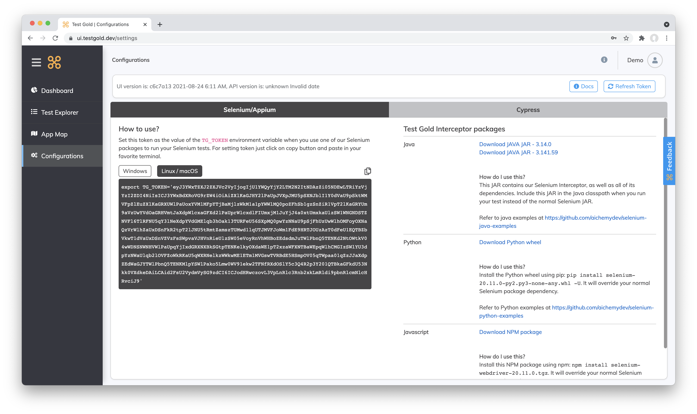
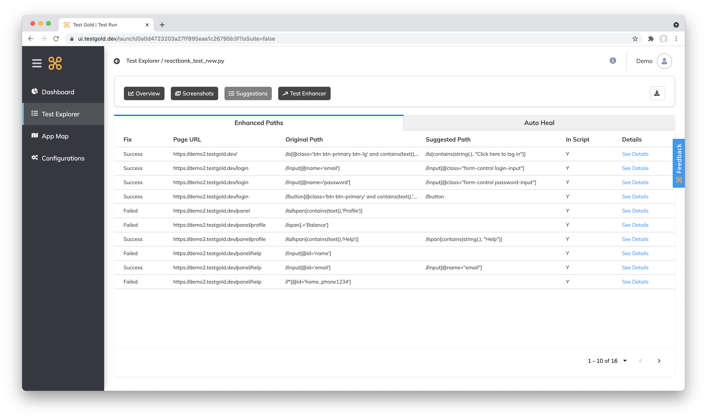

Start Here
===========

TestGold key concepts
---------------------

TestGold is a test automation solution that uses deep learning to auto heal test decay caused by rapid feature addition. Unlike other solutions,
TestGold works with your existing tests and resources, without having to learn a new language/framework or do anything differently.
You can start using the TestGold solution in less than 10 minutes.

It's for coders who want to keep their existing workflow while enjoying AI based
healing, stability, and easy test augmentation.  It will reduce costs and risks
by easily ensuring the health and auto-maintenance of your tests.
TestGold is the only automation solution of its kind that auto-completes your
tests.

.. image:: _static/testgold_testrun_summary_page.png
   :width: 100%
   :align: center
   :alt: TestGold Summary Page

How to get Started
-------------------

The first step is Registration. Creating an account on TestGold is extremely simple. On the https://nocode.testgold.dev/login page click on Sign up.
You can either choose the sign up using Github , sign up using Google Option or just enter a suitable email id and password.

.. image:: _static/testgold_signup_page.png
   :width: 100%
   :align: center
   :alt: TestGold Sign Up Page

Once you are signed up you will receive a mail. Click on the the link on the mail to verify your account.
Once verified your account will be activated by the TestGold team in 24 hours. You know have a Token known as the TG_TOKEN.
This is unique to your username and enabled you to run your scripts using TestGold.

The second step is to login. Once you login you will see the configurations page. Download the appropriate interceptor package .
You can choose either Python , Java , Javascript, Cypress or Appium . Add the required settings mentioned for each interceptor.
Set your TG_TOKEN value. Run your scripts now and get ready to see the magic happen.

Navigating the TestGold UI
---------------------------

The Dashboard

.. image:: _static/testgold_dashboard_page.png
   :width: 100%
   :align: center
   :alt: TestGold Dashboard Page

The Dashboard provides an overview of the lifetime productivity improvements and test statistics. It tells you how much time you have saved ,
the total number of healing and suggestions etc.

The Test Runs Page

.. image:: _static/testgold_testruns_page.png
   :width: 100%
   :align: center
   :alt: TestGold Test Runs Page

This page displays the test runs along with quick access to high level information such as a description, run time, total paths, healed paths . 
By default, the your results will be displayed chronologically. Clicking on a Test Run shows you further detail about the particular Test Run.

You can also access more options for each test by selecting the vertical elipses at the right of each row. Options here include the ability to update run info, retry the test, or remove it.

Test Run Details

Test Run Summary

.. image:: _static/testgold_testrun_summary_page.png
   :width: 100%
   :align: center
   :alt: TestGold Test Runs Page

The summary page gives you all statistics about the Test Run. It highlights the time saved for the test run, suggestions offered
, Auto-Heals performed.

Test Run Screenshots

.. image:: _static/testgold_testrun_screenshots_page.png
   :width: 100%
   :align: center
   :alt: TestGold Test Runs Screenshots Page

This page shows screenshot per selector. The user can filter by Suggestions or
Heals .  If a particular Screenshot has a heal , the user can use the feedback
carousel to change the value to a different value from the one auto generated by
our algorithm. It also shows you the original value and the TestGold value side
by side to enable comparison of the accuracy.

Test Run Suggestions

This page shows all the suggested selectors as well as any selectors that have been healed automatically. In the enhanced paths tab, you can click the details button to see more suggestions that may be available.
In the right hand side of the action bar, you can access multiple download options. Here, you can download a csv file containing all suggestions that have been generated. Depending on the type of test, you may have more options available here.
Some of those options include the ability to download a copy of your Katalon xml, generate Selenium page object models and test or Cypress test files. 

