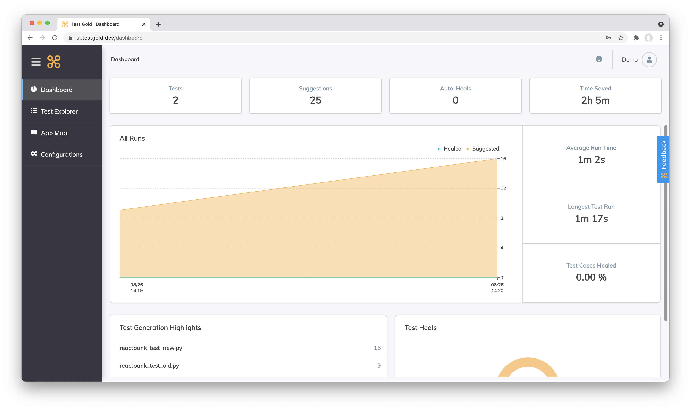
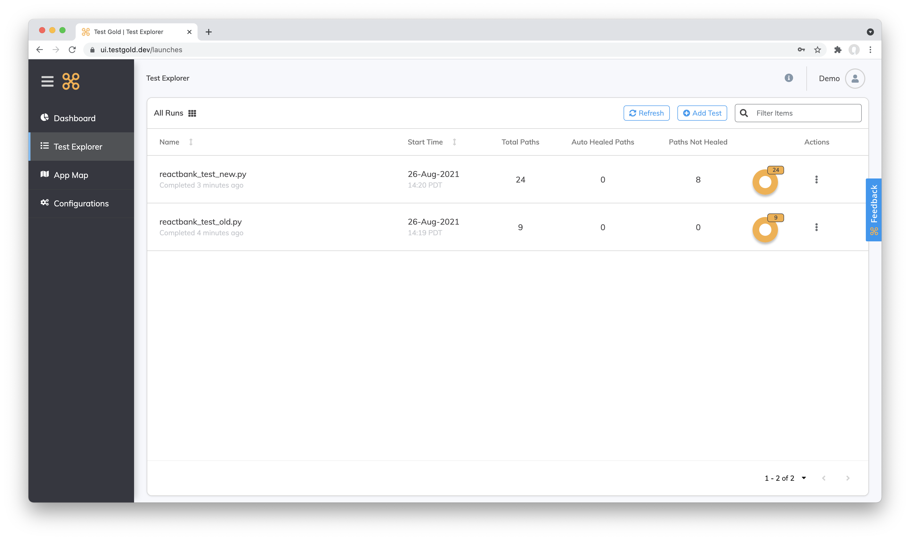
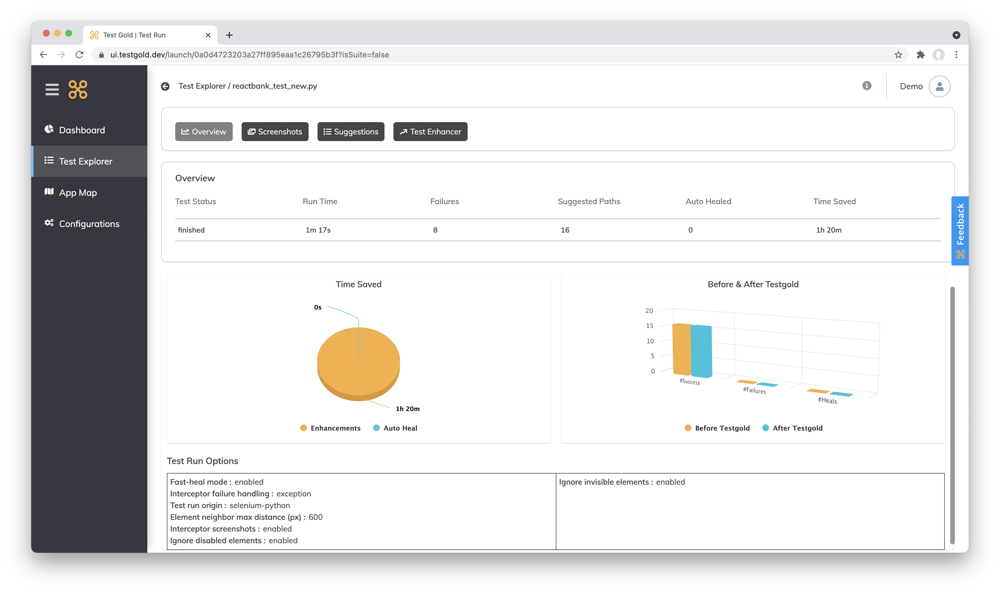

Start Here
===========

TestGold key concepts
---------------------

TestGold is a test automation solution that auto heals your existing selenium tests and ensures they will
continue to work even after your application software changes. Unlike other solutions,
TestGold works with your existing selenium tests and resources, without having to learn a new language/framework or do anything differently.
You can start using the TestGold solution in less than 10 minutes.

It's for selenium coders who want to keep using Selenium while enjoying AI based
healing, stability, and easy test augmentation.  It will reduce costs and risks
by easily ensuring the health and auto-maintenance of your selenium tests.
TestGold is the only automation solution of its kind that auto-completes your
tests.

How to get Started
-------------------

The first step is Registration. Creating an account on TestGold is extremely simple. On the https://nocode.testgold.dev/login page click on Sign up.
You can either choose the sign up using Github , sign up using Google Option or just enter a suitable email id and password.

Once you are signed up you will receive a mail. Click on the the link on the mail to verify your account.
Once verified your account will be activated by the TestGold team in 24 hours. You know have a Token known as the TG_TOKEN.
This is unique to your username and enabled you to run your scripts using TestGold.

.. image:: _static/testgold_config_page.png
   :width: 100%
   :align: center
   :alt: TestGold Configuration Page

The second step is to login. Once you login you will see the configurations page. Download the appropriate interceptor package .
You can choose either Python , Java , Javascript, Cypress or Appium . Add the required settings mentioned for each interceptor.
Set your TG_TOKEN value. Run your scripts now and get ready to see the magic happen.

Navigating the TestGold UI
---------------------------

The Dashboard

The Dashboard has a summary of all the TestRuns run until now. It tells you how much time you have saved ,
the total number of healing and suggestions etc.

The Test Runs Page

This page contains all the Tests run so far. It shows the Test Run , time taken , #heals , # suggestions and Run time.
The latest test is always on top. Clicking on a Test Run shows you further detail about the particular Test Run.

Test Run Details

Test Run Summary

The summary page gives you all statistics about the Test Run. It highlights the time saved for the test run, suggestions offered
, Auto-Heals performed.

Test Run Screenshots

.. image:: _static/testgold_testrun_screenshots_page.png
   :width: 100%
   :align: center
   :alt: TestGold Test Runs Screenshots Page

This page shows screenshot per selector. The user can filter by Suggestions or
Heals .  If a particular Screenshot has a heal , the user can use the feedback
carousel to change the value to a different value from the one auto generated by
our algorithm. It also shows you the original value and the TestGold value side
by side to enable comparison of the accuracy.

Test Run Screenshots

.. image:: _static/testgold_testrun_table_page.png
   :width: 100%
   :align: center
   :alt: TestGold Test Runs Table Page

This view shows all the Selectors in a table form. It also lists out the entire set of suggestions provided by TestGold.
You can also see the original selectors , healed selectors etc in the table format. The user can also download all the data to a CSV and
analyse at leisure.
