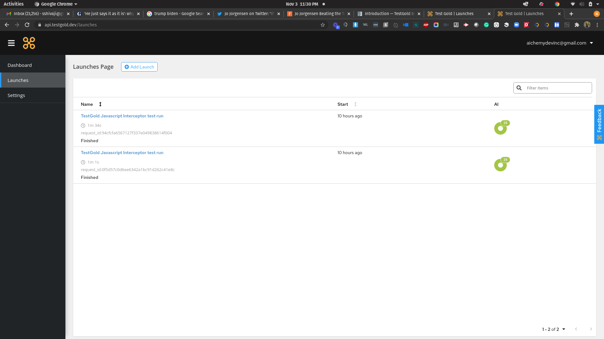

Introduction
============

Presentation
------------

TestGold is a test automation solution that heals your selenium tests and ensures they will
continue to work even after your application software changes. Unlike other solutions,
TestGold works with your existing selenium tests and resources, without having to learn a new language/framework or do anything differently.

It's for selenium coders who want to keep using Selenium while enjoying AI based
healing, stability, and easy test augmentation.  It will reduce costs and risks
by easily ensuring the health and auto-maintenance of your selenium tests.
TestGold is the only automation solution of its kind that auto-completes your
tests.

A good illustration of the Automation Nowhere problem without using solutions like TestGold is:

Source: Infosys 2019

As you can see, after a bunch of automation tests are in place, due to the pace of application changes,
maintenance of existing tests becomes more important than increasing coverage.

Features
--------

Heals Selenium Tests written in
    - Java
    - Javascript and Typescript (NodeJS)
    - Python
    - Selenium IDE (very handy for Manual QA or Business Analysts)

- Visual view of your tests and the healing that was done

- Learns from your working tests and applies the knowledge to broken tests

- Makes suggestions on working and failing tests to improve maintainability

- Visual Dashboards, Filters, and ability to view history

Availability
------------

1. Sign up for a free account at `https://nocode.testgold.dev
   <https://nocode.testgold.dev>`_.

2. Your account will be fully activated shortly.

You should get an email soon after signup. The process is rather simple and
illustrated here:

.. raw:: html

   
<iframe src="https://www.loom.com/embed/c85b479808344199b0dbf5d886c67fe4" frameborder="0" webkitallowfullscreen mozallowfullscreen allowfullscreen style="position: absolute; top: 0; left: 0; width: 100%; height: 100%;"></iframe>

Status
------

Here are some videos from our beginning :-)

We are rapidly changing. There are more detailed examples in the examples section.

Healing -

.. raw:: html

    
<iframe src="https://www.loom.com/embed/0b75254982944f8cb044c7fa27c07a55" frameborder="0" webkitallowfullscreen mozallowfullscreen allowfullscreen style="position: absolute; top: 0; left: 0; width: 100%; height: 100%;"></iframe>

