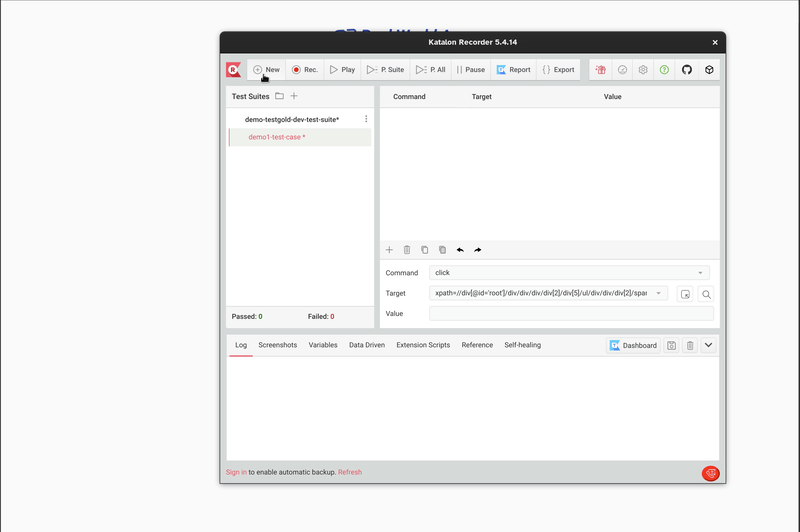
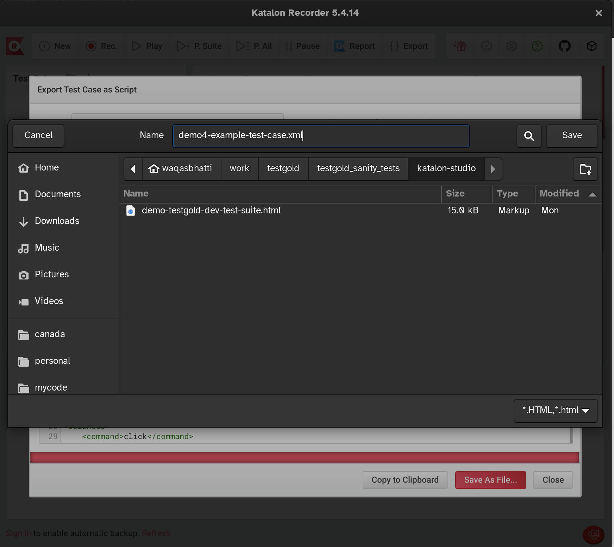
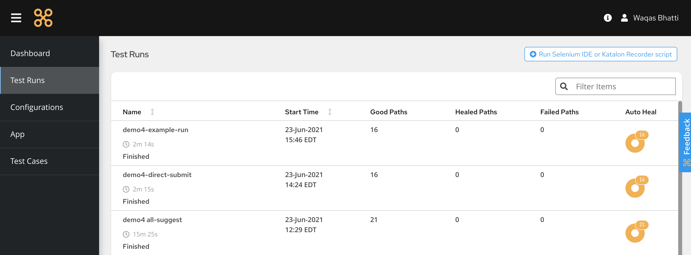
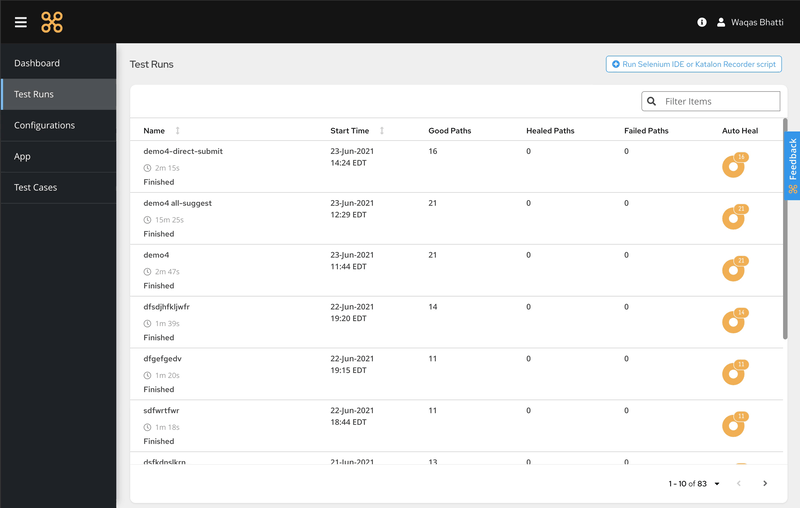
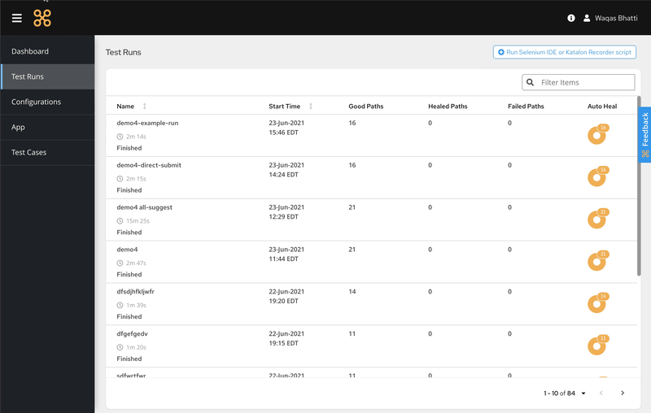

Enhancing Katalon Recorder scripts with TestGold
================================================

Katalon Recorder is a popular solution to quickly generate selectors in
preparation for testing a webpage. The TestGold platform can ingest exported XML
files from the Recorder and automatically generate robust selectors.

Below, we describe how to export XML from Katalon Recorder, upload it to the
TestGold platform, and then get back robust selectors.

Record a test and export it to XML
----------------------------------

Use Katalon Recorder to record a test.

After you're done recording, removing extraneous test actions (such as
mis-clicks, clicking outside of input boxes, etc.) is optional; if TestGold
detects a valid CSS or XPath selector, it will process it.

The Chrome browser is used to execute the test steps. We currently support the
following test step actions:

- open
- click
- doubleClick
- contextClick (right-click)
- mouseOver
- submit (direct form submission)
- ``<select>`` element interactions (choose options by value, index, or label)
- type

More step actions will be added soon. If your specific use case requires a step
action not listed above, please let us know at `support@testgold.dev
<mailto:support@testgold.dev>`_.

Export your recorded test to XML.

.. image:: _static/katalon-export.png
   :width: 100%
   :align: center
   :alt: Katalon Recorder export test

Make sure the file saved ends with ``.xml``.

Upload the exported test script to TestGold
-------------------------------------------

Log in to the TestGold dashboard and then click on the **Add Test** button. This brings up the following form:

Give your test run a name and upload your exported XML file. Click on **Run test
script** and wait for the test run to complete. This menu also contains several run options.

- **Ignore disabled elements**: 

- **Ignore invisible elements**: 

- **Collect element data & try to fix broken selectors**: Selecting this option enabled deep heal. This will make testgold compare the results of the whole script and rewrite them, if it finds collisions.

- **Generate selectors for all elements on each visited page**: Selecting this option will generate optimal selectors for all elements on the pages visited during this test. This is a very intensive process and test execution time is dependent on the number of elements that exist on the pages.

- **Collect page-interaction event data for test case augmentation**: This option allows you to take advantage of features in the test enhancer and app map sections of the product.

- **Continue test suite execution if a component test fails**: Test suites may sometimes be depend on the successful completion of earlier tests for later tests to pass. In that case, using this option will avoid unecessary runs in the case a test fails earlier in the test suite.

View results
------------

Once the test run is complete, you can browse the results.

Note the enhanced selectors automatically generated by the TestGold
platform. The following actions are available to interact with the results:

- Screenshots are provided to walk you through your test's steps
- The test results and lists of selectors can be exported to CSV and PDF for
  later use.
- A video of the browser executing your test steps is available to view.
- The actual Katalon exported XML file uploaded for the test run is available to
  download.
- Console logs from our hosted Selenium test runners indicating the exact steps
  executed as we process your exported Katalon Recorder XML file are available
  to view.
