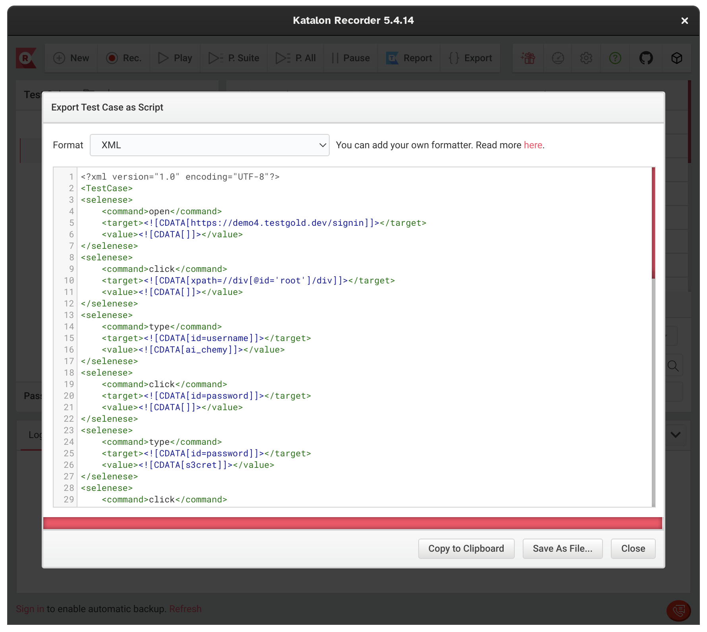
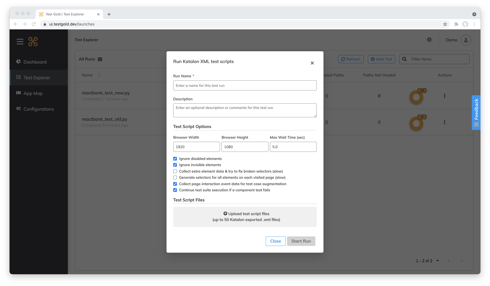

Enhancing Katalon Recorder scripts with TestGold
================================================

Katalon Recorder is a popular solution to quickly generate selectors in
preparation for testing a webpage. The TestGold platform can ingest exported XML
files from the Recorder and automatically generate robust selectors.

Below, we describe how to export XML from Katalon Recorder, upload it to the
TestGold platform, and then get back robust selectors.

1. Record a test and export it to XML
-------------------------------------

Use Katalon Recorder to record a test.

.. image:: _static/katalon-recorder.gif
   :width: 100%
   :align: center
   :alt: Katalon Recorder test recording

After you're done recording, removing extraneous test actions (such as
mis-clicks, clicking outside of input boxes, etc.) is optional; if TestGold
detects a valid CSS or XPath selector, it will process it.

We currently support the following test step actions:

- open
- click
- doubleClick
- contextClick (right-click)
- mouseOver
- submit (direct form submission)
- type

More step actions will be added soon. If your specific use case requires a step
action not listed above, please let us know at `support@testgold.dev
<mailto:support@testgold.dev>`_.

Export your recorded test to XML.

Make sure the file saved ends with ``.xml``.

2. Upload the exported test script to TestGold
----------------------------------------------

Log in to the TestGold dashboard and then click on the **Run Selenium IDE or
Katalon Recorder script** button.

This brings up the following form:

Give your test run a name and upload your exported XML file. Click on **Run test
script** and wait for the test run to complete.

3. View results
---------------

Once the test run is complete, you can browse the results.

.. image:: _static/katalon-results.gif
   :width: 100%
   :align: center
   :alt: Katalon Recorder test recording

Note the enhanced selectors automatically generated by the TestGold
platform. Screenshots are also provided to walk you through your test's
steps. You can export these results to CSV and PDF for later use. Finally, we
also provide the console logs from our hosted Selenium test runners indicating
the exact steps executed as we process your exported Katalon Recorder XML file.
