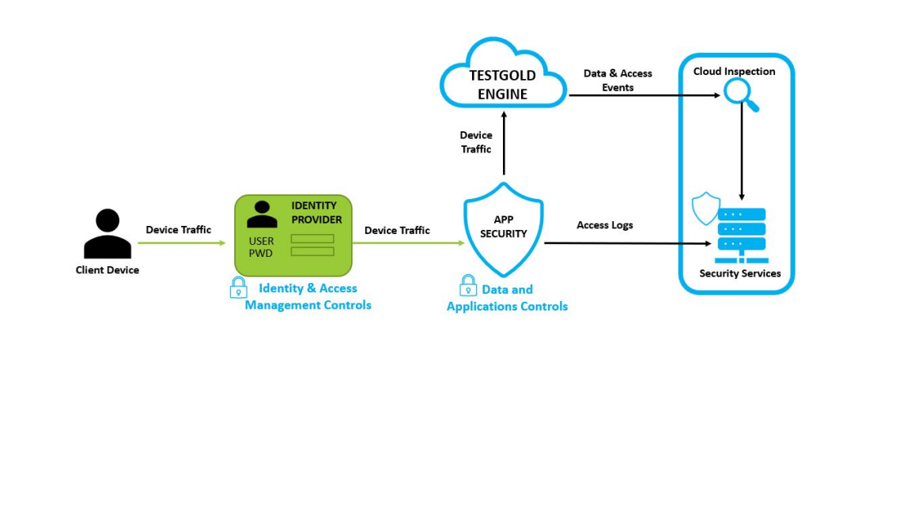

TESTGOLD™ Platform Security Highlights
======================================

User model
----------

TESTGOLD™supports the standard enterprise user model of organizations, teams, and individual
user accounts. Organizations are the base of our user model. Each organization is specified by
its own unique key in the platform's database, and all teams and user accounts within an
organization share the same key for data access, as well as provisioning of user accounts.
Customers may designate teams or individual users as organization/team administrators. will
allow for data management and user management .
All actions performed by users are noted in an audit log. Importation of teams and user account
information for an organization using directory services (Active Directory, LDAP) is planned for a
future release..

Individual user accounts are constrained by product tiers. Limits on the number and frequency
of actions performed , the number of concurrent jobs that can be launched, and allocated disk
space quotas are managed this way.
These constraints can be controlled by administrators. Access control is defined by user roles,
which have privileges mapping to the usual create, list, read, update, and delete permissions.
These user roles may be assigned to teams or individual users within the organization.

All user account information (user IDs, names, and passwords, etc.) is stored in a SQL database.
The only service allowed to directly talk to this database is our authentication/authorization
server;all other services route their requests for user information or data through it.
User account passwords are stored using the Argon2-id hash, and have specific checks for weak
passwords, as well as previously leaked credentials using the haveibeenpwned.com API.
Client-facing web services accept signed OAuth2 JWTs that must be verified for every request
and have appropriate rate-limiting in place in the case of repeated invalid credentials.
Two-factor authentication and delegated login via more services is planned for a future release.
Github and Google are currently supported.

Data storage
------------

Client data is stored in a document database cluster. All database keys are prefixed by
organization, team, and individual user account identifiers and are thus constrainable at any of
these levels. Data access and viewing privileges are defined accordingly.
The TESTGOLD™ document database is replicated and highly-available using Kubernetes.
Individual nodes in our database cluster use standard LUKS for data encryption at rest. All
internal traffic in our database cluster as well as our compute cluster is encrypted in-flight via
TLS.

