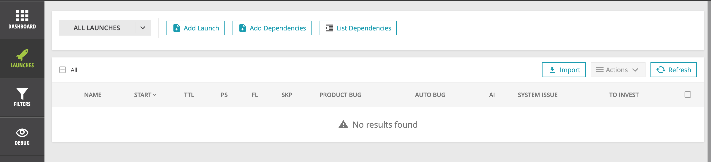
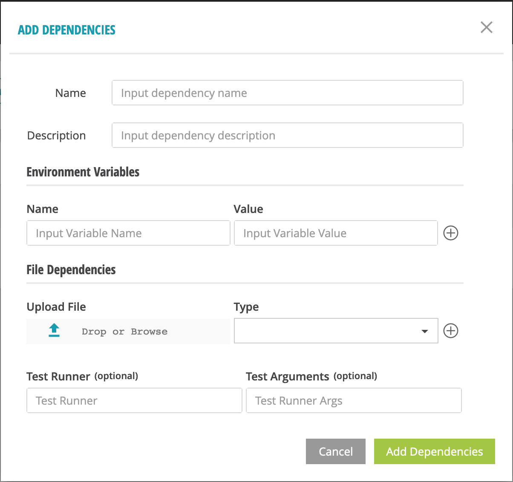
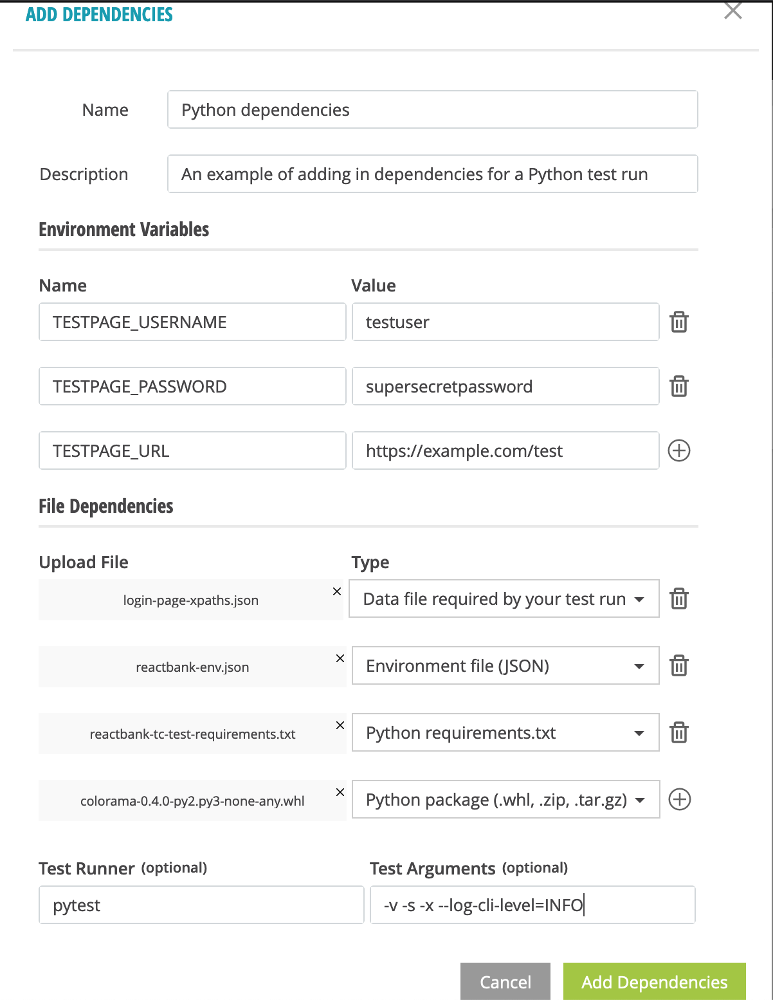
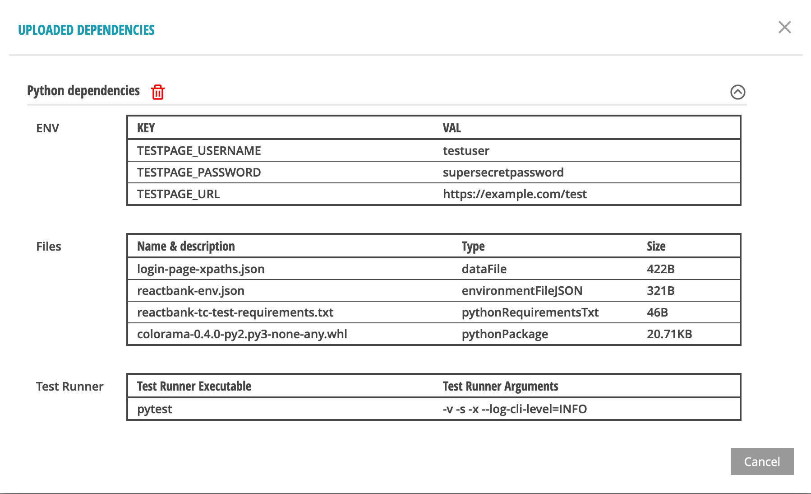
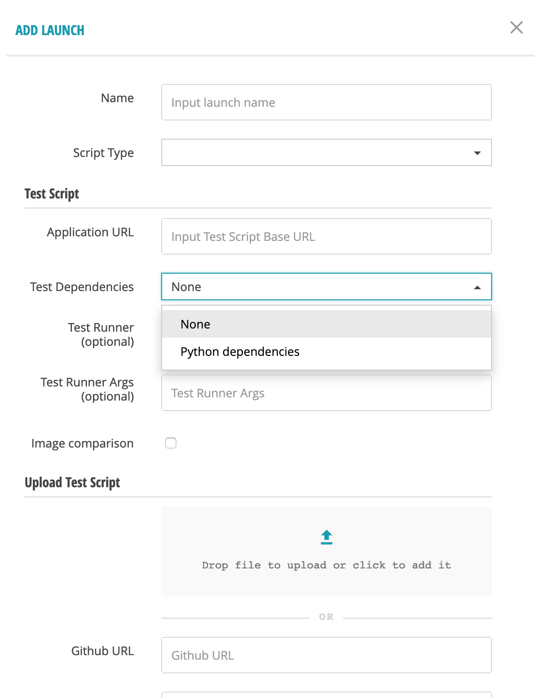

Using dependencies for test runs
================================

You can specify dependencies for your test script or package. We currently
support the following types of dependencies for Javascript/Typescript and Python
tests:

1. environment variables, specified directly or in the form of files (JSON,
   YAML, .env)

2. data files required by your test

3. Javascript or Python package files required by your test

4. package dependency specifications in the form of package.json (Javascript) or
   requirements.txt (Python) files

5. archive files required by your test

Test dependencies are not yet supported for Java test runs. Support for this
use-case will be added soon.

Adding test dependencies
------------------------

After login, the interface looks like the screenshot below:

To add a test dependency item, click on **Add Dependencies**. This will bring up
a modal dialog similar to the one below:

First, type in a **Name** for your test dependency item. The name is required
and must not be the same as any your existing test dependency items. Next, fill
out the optional **Description** for this item.

You may specify any environment variables you wish to make available for your
test script in the **Environment Variables** form. The loading order for
environment variables loaded in the test run environment is:

1. environment variables from test dependency environment files (JSON, YAML,
   .env).

2. environment variables specified directly in the **Environment Variables**
   form for a test dependency item.

3. environment variables set in your actual test run script

Environment variables specified multiple times will be overwritten in the order
above.

Specify any file dependencies in the **File Dependencies** form. Make sure to
check and set the correct file type for each file dependency you add to the
form; this will let our platform treat these correctly when your test run
starts.

An example of a filled out form specifying Python dependencies is shown below.

The following types of file dependencies are supported:

- **archiveFile:** Any file that must be unpacked in the test run folder. This
  must be one of the following types: .zip, .tar.gz, .tgz, .tar.bz2. If these
  files contain folders, they will be placed in the test run folder exactly as
  specified in the archive file.

- **dataFile:** Any file that contains data relevant for your test run. Examples
  are JSON or YAML files containing xpaths or URLs to test. These will be placed
  in the root of the test run directory.

- **environmentFile:** A file containing environment variables in
  ``VARIABLE=VALUE`` format, one per line. This is usually referred to as an
  .env file.

- **environmentFileJSON:** A file containing environment variables in
  JSON format. This must be in key-value format, for example ::

    {
       "GOOD_REACTBANK_LANDING_PAGE_URL": "https://demo1.testgold.dev",
       "BAD_REACTBANK_LANDING_PAGE_URL": "https://demo2.testgold.dev",
       "REACTBANK_COMPLAINT_FULLNAME": "Node Environment Jones",
       "REACTBANK_COMPLAINT_EMAIL": "nodeenvjones@example.com",
       "REACTBANK_COMPLAINT_MESSAGE": "This bank stole all my money!"
    }

- **environmentFileYAML:** A file containing environment variables in YAML
  format. This must be in key-value format, for example ::

    GOOD_REACTBANK_LANDING_PAGE_URL: "https://demo1.testgold.dev"
    BAD_REACTBANK_LANDING_PAGE_URL: "https://demo2.testgold.dev"
    REACTBANK_COMPLAINT_FULLNAME: "Node Environment Jones"
    REACTBANK_COMPLAINT_EMAIL: "nodeenvjones@example.com"
    REACTBANK_COMPLAINT_MESSAGE: "This bank stole all my money!"

- **jsFile**: A Javascript or Typescript file that is required for your
  test. This will be placed in the root of the test run directory.

- **jsPackage**: A Javascript or Typescript NPM package that is required for
  your test. This will be unpacked in the test run folder, then installed using
  ``npm install``.

- **jsPackageJSON**: An NPM package.json file containing JS dependencies for
  your test. This will be parsed and the dependencies specified within will be
  installed using ``npm install``.

- **pythonFile**: A Python file that is required for your test. This will be
  placed in the root of the test run directory.

- **pythonPackage**: A Python package that is required for your test. This will
  be unpacked in the test run folder, then installed using ``pip install``.

- **pythonRequirementsTxt**: An Python requirements.txt file containing PyPI
  dependencies for your test. This will be parsed and the dependencies specified
  within will be installed using ``pip install -r``.

The final item to consider while adding test dependencies is specifying a **Test
Runner** and its **Test Runner Arguments**. This is useful for test scripts that
are uploaded as packages. Here, you can specify which test runner executable
should be used to run your test.

We support the following test runners that can be specified in the **Test
Runner** form input box.

- Python: **python**, **python3**, **python3.8**, **pytest**

- Javascript/Typescript: **node**, **ts-node**, **npm**, **npx**, **mocha**

- Java: **java**

- Generic: **bash**

The **Test Runner Arguments** form input box can be used to specify any
arguments to any of these runners. Note the following restrictions:

- Direct execution of commands by an interpreter (like python3, node, bash) is
  not allowed, so ``-c``, ``-s``, etc.  arguments specified here will be
  removed.

- References in the test runner arguments to anything outside the test run
  directory will cause the test run to fail.

- Shell pipes and redirection are not allowed in the test runner arguments.

Listing test dependencies
-------------------------

Once you've filled out the test dependencies form, it will show up in the modal
dialog after you click on **List Dependencies** on the **Launches** page.

From this list, you can delete an unwanted test dependency item if desired.

Using test dependencies
-----------------------

To use a test dependency, find and select it in the **Test Dependencies** select
box control in the **Add Launch** modal dialog.

To override the test dependency item's **Test Runner** and **Test Runner
Arguments** for this specific test run, you can specify these in the
corresponding input boxes in the **Add Launch** modal dialog.
