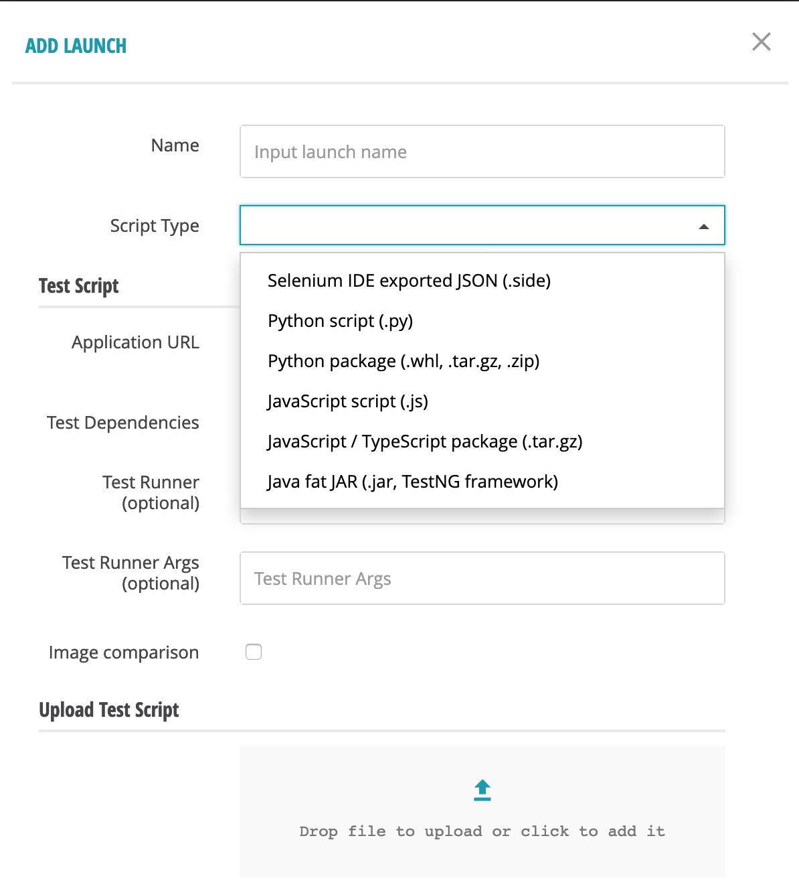

Using packages for running tests
================================

The TestGold platform now accepts test script packages in the following formats:

- Python package (wheel binary distribution; .tar.gz, .zip source distributions)

- Javascript/Typescript NPM package (.tar.gz, .tgz)

To use these, specify your test script's file type when you upload it:

Uploaded packages must be installable by the language specific package manager:

- For Python: we create a Python 3.8 virtualenv in the test run directory,
  unpack your package there, and then install it using ``pip install -e``.

- For Javascript/Typescript: we run ``npm install`` in the test run directory
  after unpacking your package file.

Examples of acceptable Python, Javascript, and Typescript packages are available
at `AIChemy <https://github.com/aichemydev>`_.

- `Python packages <https://github.com/aichemydev/selenium-js-examples/tree/master/packages/reactbank-good-pypackage/dist>`_
- `Javascript packages <https://github.com/aichemydev/selenium-js-examples/tree/master/packages/reactbank-good-jspackage>`_
- `Typescript packages <https://github.com/aichemydev/selenium-js-examples/tree/master/packages/reactbank-good-tspackage>`_

Examples of acceptable Python, Javascript, and Typescript packages that use test
dependencies are also available:

- `Python packages with test dependencies <https://github.com/aichemydev/selenium-js-examples/tree/master/packages/reactbank-tc-good-pypackage/dist>`_
- `Javascript packages with test dependencies <https://github.com/aichemydev/selenium-js-examples/tree/master/packages/reactbank-tc-good-jspackage>`_
- `Typescript packages with test dependencies <https://github.com/aichemydev/selenium-js-examples/tree/master/packages/reactbank-tc-good-tspackage>`_

These use the following test dependency items: `testconfig-items
<https://github.com/aichemydev/selenium-js-examples/tree/master/testconfig-items>`_.
